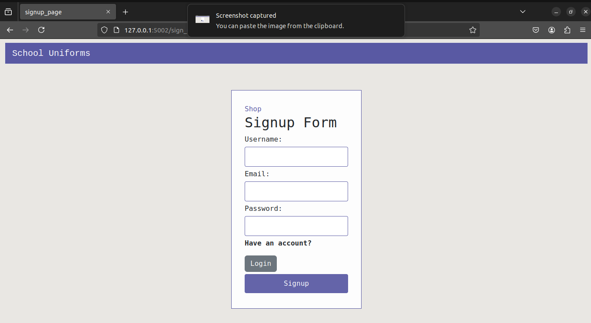
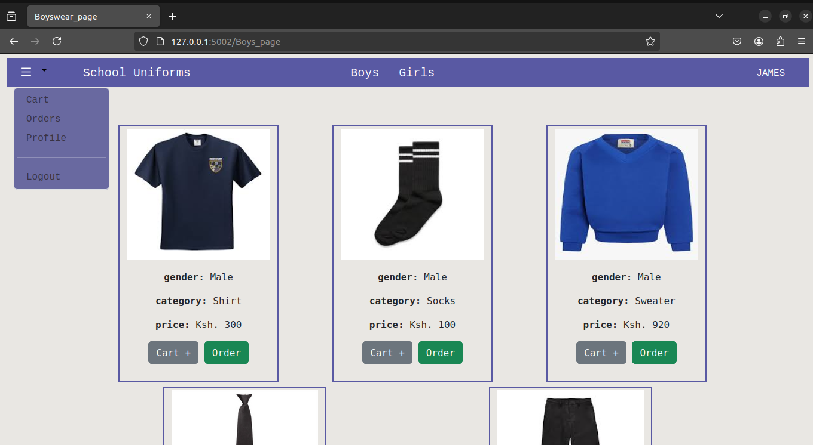

# Automobile E-Commerce Site (Flask)

This project is a web-based automobile e-commerce site built using the Flask framework in Python. It allows users to browse through a database of vehicles, potentially search for specific models, and potentially complete purchase transactions (depending on the level of implementation).

**Project Structure:**

* `app/`: Contains the core Flask application logic, including routes, models, forms, and templates.
* `static/`: Houses static assets like CSS stylesheets, HTML templates, JavaScript files, and images.
* `__init__.py`: Initializes the Flask application.
* `requirements.txt`: Lists the project's Python dependencies.
* `run.py`: The main script for starting the Flask application.

**Running the App:**

**Prerequisites:**

- Python 2.x, 3.x installed on your system.

**Steps:**

1. **Configure Port:**
   - Open `run.py` and adjust the `port` variable to a free port on your machine.

2. **Install Dependencies:**
   - Open a terminal in your project directory and run:

     ```bash
     pip install -r requirements.txt
     ```

3. **Start the Development Server:**
   - Run the Flask application using one of the following methods:

     - **Direct Method:**

       ```bash
       python run.py  # or python3 run.py on systems with Python 3 as default
       ```

     - **Using Gunicorn with Nginx (optional):**

       ```bash
       gunicorn -w 4 -b 0.0.0.0:8000 run:app
       ```
       (Replace `8000` with your desired port.)
       
4. **clone the repository:**
   ```bash
   git clone https://github.com/binarymusa/UniformStore.git


**Screenshots:**

**Login Page:**


**Signup Page:**



**Maket Page:**



**Cart Page:**


**Orders Page:**


